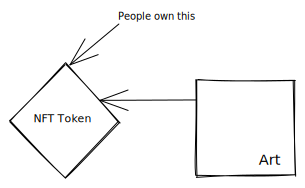

## Fungible token

It doesn't hold a unique value. For instance, when you and your friend get 1 Ethereum (ETH) which is an ERC20 token each. Both of you have the same value. It's uniform. Think of it like money but in token.
Example of fungible tokens:

- ERC20
- ERC777

## Non-fungible token

It holds a unique value. For instance, when you get that limited edition art as NFT. You owned it. Your ownership is on the blockchain. Since the data inside blockchain is immutable, people can't manipulate it to have their own name unless they buy it from the owner of the NFT via NFT marketplace.

Example of non-fungible tokens:

- ERC-721 from Ethereum network
- HRC-721 from Harmony network

